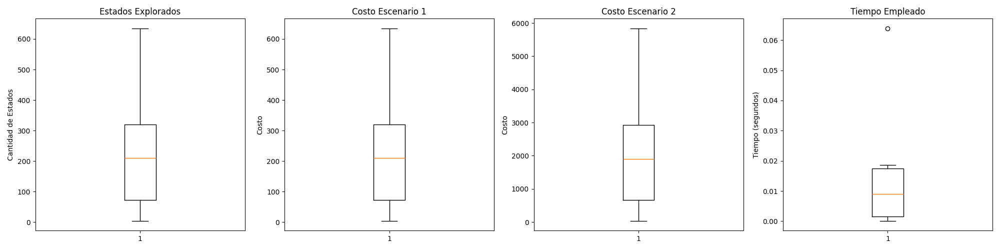

# Informe sobre Algoritmos de Búsqueda en el Entorno FrozenLake

## Introducción

Este informe tiene como objetivo exponer la implementación de un agente que resuelve el problema del entorno FrozenLake y entornos deterministas aleatorios de 100x100 utilizando diferentes algoritmos de búsqueda. El propósito es evaluar el rendimiento de estos algoritmos en escenarios aleatorios y comparar los resultados obtenidos.

### Algoritmos Implementados:
- Búsqueda en Anchura (BFS)
- Búsqueda en Profundidad (DFS)
- Búsqueda en Profundidad Limitada (DLS)
- Búsqueda de Costo Uniforme (UCS)  
- Búsqueda Informada (A*)

Cada algoritmo se ejecutó 30 veces en diferentes configuraciones del entorno, y se midieron los siguientes parámetros:
- Cantidad de estados explorados
- Costo total de las acciones tomadas
- Tiempo empleado (en segundos)

Además, se repitió el experimento con un agente aleatorio, y los resultados fueron presentados mediante gráficos de cajas y bigotes.

## Marco Teórico

### Agentes Inteligentes

En el contexto de este informe, el agente utilizado es un **agente basado en objetivos**. Este tipo de agente tiene la tarea de encontrar la secuencia de acciones que lo lleve desde su estado inicial hasta un estado objetivo.

Los agentes que resuelven problemas deben operar en ambientes:
- **Estáticos**: El ambiente no cambia durante la ejecución del agente.
- **Observables**: El agente puede conocer su estado actual.
- **Deterministas**: El resultado de una acción es siempre predecible.
- **Discretos**: El tiempo y las acciones están claramente definidos.

#### Formulación del Problema
- **Estado inicial**: La posición del agente en el entorno.
- **Función sucesor**: Generación de los posibles movimientos del agente.
- **Espacio de estados**: El conjunto de todos los estados posibles que el agente puede explorar.
- **Función de evaluación del objetivo**: Verificación de si el agente ha llegado a la meta.
- **Función de costo**: Medición del costo asociado a las acciones tomadas por el agente.

## Diseño Experimental

### Medida de Rendimiento

La medida de rendimiento es la cantidad de **estados explorados** por el agente para llegar al objetivo. Esta métrica refleja la eficiencia del agente para cumplir su tarea en el entorno.

### Configuración del Entorno

Para evaluar el rendimiento de los agentes, se utilizaron entornos **FrozenLake** con diferentes configuraciones:
- Tamaño del mapa
- Proporción de huecos (casilleros peligrosos)
- Posición inicial del agente

Se implementó una clase `Environment` para gestionar las configuraciones aleatorias de los entornos, y se utilizó la función `generate_random_map_custom` para crear mapas de tamaño variable, con casilleros seguros y peligrosos.

### Programación del Nodo

La clase `Nodo` representa un estado dentro del entorno de búsqueda, y se diseñó con los siguientes atributos:
- **estado**: Representa la posición del agente.
- **parent**: El nodo anterior en el recorrido.
- **action_number**: La acción realizada para llegar a este nodo.
- **path_cost**: Costo acumulado para llegar a este nodo desde el inicial.

### Generación de Acciones Posibles

El método `possible_actions` genera las acciones posibles desde el estado actual del agente, revisando las posiciones adyacentes y asegurándose de que no sean huecos (es decir, posiciones seguras). Estas acciones son vitales para los algoritmos de búsqueda.

### Integración con Algoritmos de Búsqueda

La estructura de la clase `Nodo` permite su uso en varios algoritmos de búsqueda:
- **BFS**: Búsqueda en anchura
- **DFS**: Búsqueda en profundidad
- **DLS**: Búsqueda en profundidad limitada
- **UCS**: Búsqueda de costo uniforme
- **A\***: Algoritmo de búsqueda informada, utilizando la heurística de Manhattan.

## Implementación de A*

Para A*, se eligió la heurística de **Manhattan**, que calcula la suma de las distancias horizontales y verticales desde la posición actual hasta el objetivo. Esta heurística es eficiente y adecuada para este tipo de entornos.

## Cantidad de Repeticiones

Cada experimento fue ejecutado 30 veces con entornos aleatorios para garantizar la robustez de los resultados. Se realizaron tanto con el **agente inteligente** como con el **agente aleatorio**.

## Análisis de Datos

Los resultados obtenidos fueron analizados mediante la media y la desviación estándar de los parámetros medidos (estados explorados, costo total, tiempo empleado). Los resultados se presentan mediante gráficos de cajas y bigotes para cada algoritmo y escenario.

### Gráfico 1: BFS
- Resultados de 30 iteraciones del algoritmo BFS. Se puede observar la cantidad de estados explorados, el costo y el tiempo empleado.

### Gráfico 2: DFS
- Resultados de 30 iteraciones del algoritmo DFS. Se observa la cantidad de estados explorados, el costo y el tiempo empleado.

### Gráfico 3: DLS
- Resultados de 30 iteraciones del algoritmo DLS. Se puede observar la cantidad de estados explorados, el costo y el tiempo empleado.

### Gráfico 4: UCS
- Resultados de 30 iteraciones del algoritmo UCS. Se observa la cantidad de estados explorados, el costo y el tiempo empleado.

### Gráfico 6: Agente Aleatorio
- Resultados de 30 iteraciones del agente aleatorio. Se puede observar la cantidad de estados explorados, el costo y el tiempo empleado.

### Gráfico 5: A*
- Resultados de 30 iteraciones del algoritmo A*. Se puede observar la cantidad de estados explorados, el costo total y el tiempo empleado.

## Conclusión

El algoritmo **A*** se destacó sobre los demás debido a su capacidad para combinar la evaluación del costo del camino y una estimación de la distancia restante al objetivo, lo que le permite explorar menos estados y llegar más rápidamente a la solución.

A* muestra una alta eficiencia en cuanto a tiempo de ejecución, recursos de procesamiento y costo total del camino recorrido, lo que lo convierte en la opción preferida cuando se necesita una solución eficiente y óptima.

Por otro lado, el agente aleatorio presentó un rendimiento considerablemente inferior, explorando más estados y con un costo mucho mayor. El algoritmo DLS, en algunos casos, no pudo encontrar una solución.

### Resumen Final

- **A\*** se mostró superior en cuanto a eficiencia y coste.
- **DFS** y **BFS** fueron efectivos pero con un mayor número de estados explorados.
- **DLS** no siempre logró encontrar solución.
- El **agente aleatorio** no mostró una capacidad significativa para resolver el problema.

