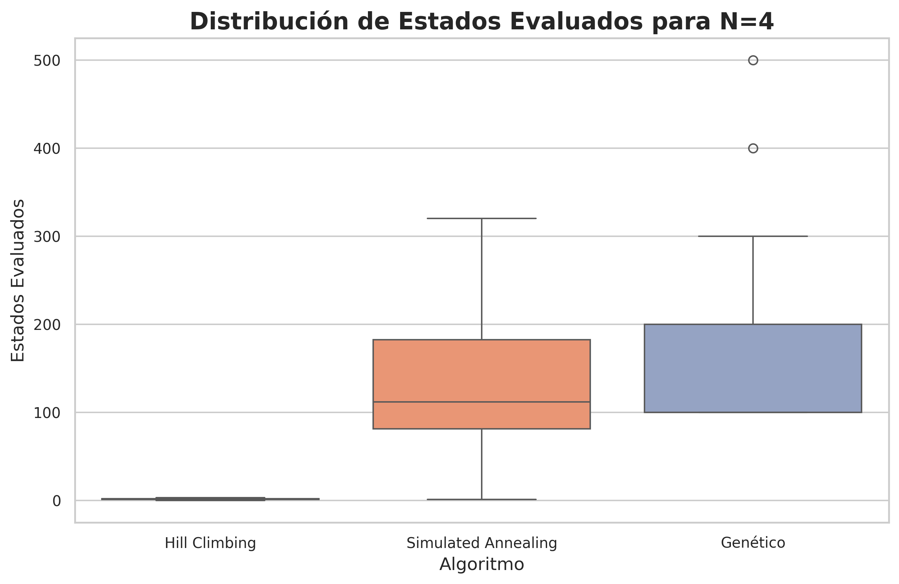
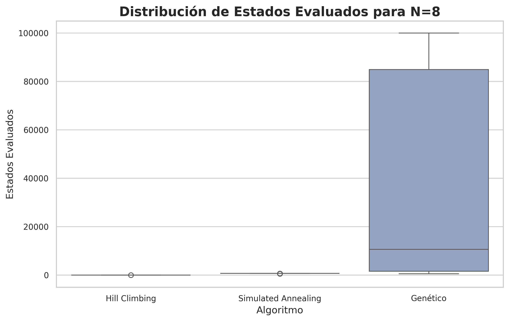
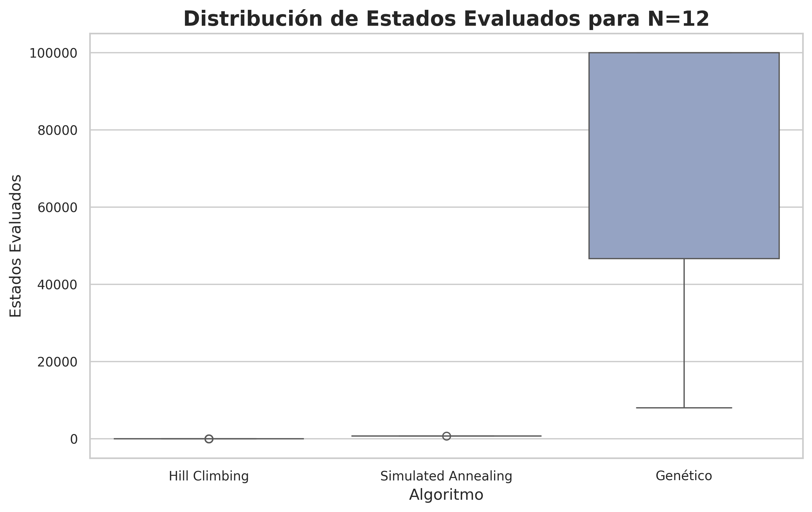
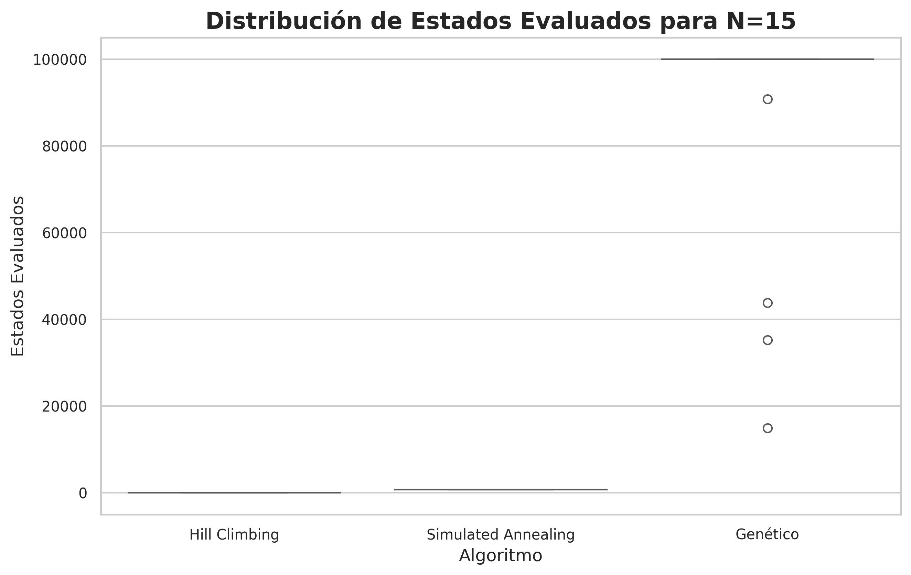
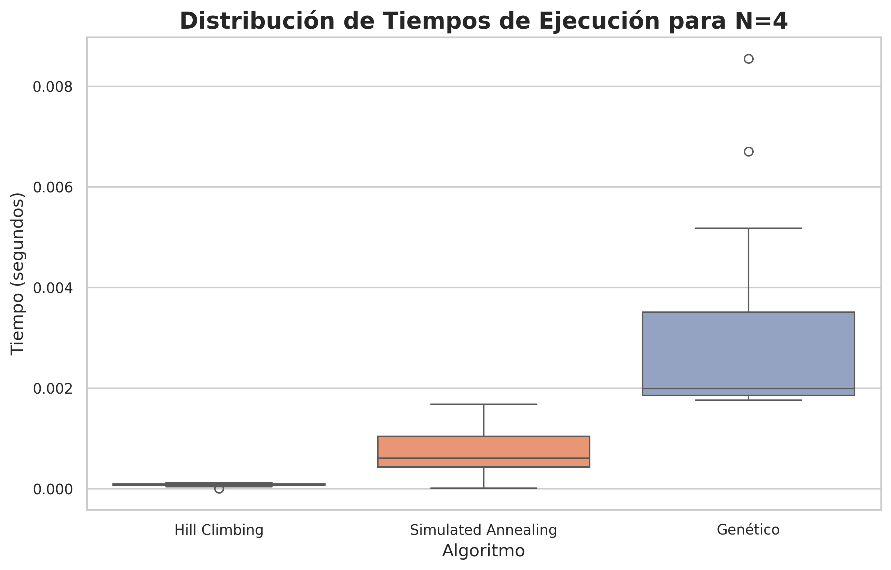
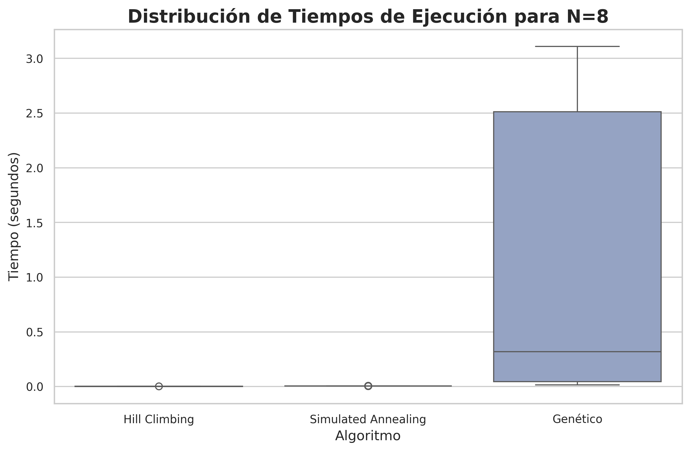
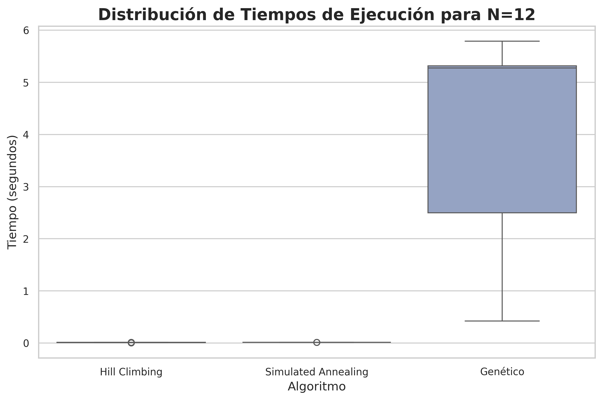
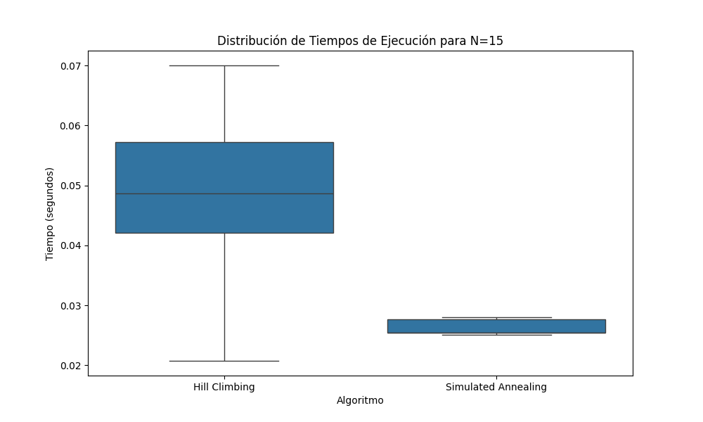

# Informe Aida Laricchia sobre el problema de las N-reinas

## Introducción

Este informe tiene como objetivo exponer la implementación de varios algoritmos para resolver el **problema de las N-reinas**. En este problema, el desafío es colocar N reinas en un tablero de ajedrez de N×N, de tal manera que ninguna reina ataque a otra. Es decir, no debe haber dos reinas en la misma fila, columna o diagonal.

Para resolver este problema, se implementaron y compararon tres algoritmos:
- **Hill Climbing (HC)**: Un algoritmo de búsqueda local que busca mejorar una solución mediante pequeños cambios.
- **Simulated Annealing (SA)**: Un algoritmo de búsqueda metaheurística que utiliza un proceso de "enfriamiento" para escapar de óptimos locales.
- **Algoritmo Genético (GA)**: Un algoritmo inspirado en la evolución natural, que busca soluciones óptimas mediante procesos de selección, cruce y mutación.

Los experimentos fueron realizados sobre varios valores de N: {4, 8, 10, 12, 15}, con 30 ejecuciones por cada valor de N para obtener estadísticas confiables. En los experimentos, se midieron el porcentaje de éxito, el tiempo de ejecución y la cantidad de estados evaluados.

## Marco Teórico

### Algoritmos de Búsqueda Local

Los algoritmos de búsqueda local son útiles cuando al agente solo le interesa alcanzar un estado objetivo y no le importa la secuencia de estados que lo lleven a él. Estos algoritmos no realizan una exploración sistemática del espacio de soluciones, sino que se mueven entre estados vecinos mediante modificaciones incrementales.

### Hill Climbing

El algoritmo **Hill Climbing** es un método iterativo que comienza con una solución arbitraria y, a través de una serie de modificaciones, trata de mejorarla. En cada iteración, se selecciona el vecino que mejora la solución actual. El proceso continúa hasta que no se pueden realizar mejoras. 

### Simulated Annealing

El **Simulated Annealing** es un algoritmo metaheurístico inspirado en el proceso de enfriamiento de metales. Utiliza una función de aceptación para permitir que, durante ciertas iteraciones, se acepten soluciones peores con una probabilidad controlada por una temperatura que disminuye con el tiempo. Esto le permite escapar de óptimos locales y explorar mejor el espacio de soluciones.

La probabilidad de aceptar una solución peor se define como:

\[
P = e^{-\Delta H / T}
\]

donde \( \Delta H \) es el cambio en la función de evaluación y \( T \) es la temperatura, que disminuye con cada iteración.

### Algoritmos Genéticos

Los **algoritmos genéticos (GA)** son métodos de optimización inspirados en los procesos de selección natural. Utilizan una población de posibles soluciones (individuos) y aplican operadores como el cruce y la mutación para generar nuevas soluciones. Los pasos fundamentales son:

1. **Población inicial**: Se genera un conjunto de soluciones posibles (individuos).
2. **Evaluación (fitness)**: Se mide la calidad de cada solución.
3. **Selección**: Se eligen las mejores soluciones para reproducirse.
4. **Cruce**: Dos soluciones se combinan para generar una nueva.
5. **Mutación**: Se realizan cambios aleatorios en algunos individuos.
6. **Reemplazo**: Las nuevas soluciones reemplazan las anteriores.
7. **Iteración**: El proceso se repite hasta alcanzar una solución óptima o un número máximo de generaciones.

El objetivo de un GA es encontrar la solución óptima de manera eficiente mediante el proceso de evolución.

## Diseño Experimental

### Descripción de los Experimentos

En este trabajo, se implementaron y compararon tres algoritmos para resolver el problema de las N-reinas: **Hill Climbing (HC)**, **Simulated Annealing (SA)** y **Algoritmo Genético (GA)**. El objetivo es minimizar los conflictos entre las reinas en el tablero, representado por la función de evaluación \( H \), que cuenta el número de pares de reinas que se atacan entre sí.

Los experimentos se realizaron con valores de N {4, 8, 10, 12, 15}, ejecutándose 30 veces para cada valor de N para obtener estadísticas confiables. Las evaluaciones máximas fueron 1000 por cada ejecución de HC y SA, mientras que en GA se ejecutaron 1000 generaciones con una población de tamaño 100.

- **Hill Climbing (HC)**: Para generar vecinos, se cambia la posición de una sola reina en el tablero. Se selecciona siempre el vecino con el menor valor de \( H \). Si no hay mejoras, el algoritmo se detiene.
  
- **Simulated Annealing (SA)**: Se utiliza una función exponencial para aceptar soluciones peores con una probabilidad controlada por la temperatura decreciente con cada iteración.
  
- **Algoritmo Genético (GA)**: Se utiliza una población de tableros donde cada tablero representa una posible solución. El cruce se realiza mediante un cruce de un punto, y la mutación se realiza de manera aleatoria en la posición de las reinas.

### Métricas Evaluadas

Las métricas que se evaluaron durante los experimentos fueron:

- **Porcentaje de éxito**: Porcentaje de ejecuciones que alcanzaron una solución óptima (H=0).
- **Tiempo de ejecución**: Tiempo promedio en segundos para encontrar la solución o realizar todas las evaluaciones.
- **Estados evaluados**: Número de estados generados durante la búsqueda.
  
## Graficos generados
**Grafico de estados N4**
  
**Grafico de estados N8**
 
**Grafico de estados N12**
 
**Grafico de estados N15**
 

**Grafico de tiempo N4**
  
**Grafico de tiempo N8**
 
**Grafico de tiempo N12**
 
**Grafico de tiempo N15**
 

## Análisis de Datos

### Porcentaje de Éxito

- **Hill Climbing** mostró un desempeño aceptable para valores pequeños de N (N=4, N=8), pero su porcentaje de éxito disminuyó significativamente para valores más grandes de N. Esto se debe a que frecuentemente se estancó en óptimos locales.
- **Simulated Annealing** fue más robusto, logrando soluciones óptimas en un mayor porcentaje de ejecuciones, especialmente para valores intermedios de N (N=8, N=10).
- **Algoritmo Genético** fue el más efectivo, alcanzando soluciones óptimas en la mayoría de las ejecuciones para todos los valores de N.

### Tiempo de Ejecución

- **Hill Climbing** fue el algoritmo más rápido, pero también el menos efectivo en términos de encontrar la solución óptima.
- **Simulated Annealing** fue más lento que Hill Climbing, pero logró mejores resultados para valores intermedios de N.
- **Algoritmo Genético** fue el más lento debido al proceso de selección, cruce y mutación, pero logró los mejores resultados en cuanto a porcentaje de éxito.

### Estados Evaluados

- **Hill Climbing** evaluó un número relativamente bajo de estados, debido a su tendencia a estancarse en óptimos locales.
- **Simulated Annealing** evaluó un número mayor de estados, lo que le permitió escapar de óptimos locales y mejorar la calidad de las soluciones.
- **Algoritmo Genético** evaluó el mayor número de estados, ya que explora el espacio de soluciones de manera más exhaustiva, aunque a un costo computacional mayor.

## Conclusión

Los resultados obtenidos demuestran que, aunque **Hill Climbing** es un algoritmo rápido, no es adecuado para valores grandes de N debido a su tendencia a estancarse en óptimos locales. **Simulated Annealing** mejora este comportamiento gracias a su capacidad para aceptar soluciones peores en ciertas condiciones, pero su efectividad disminuye a medida que N aumenta.

El **Algoritmo Genético** demostró ser el más robusto y efectivo para resolver el problema de las N-reinas, alcanzando soluciones óptimas en la mayoría de las ejecuciones, aunque su tiempo de ejecución fue mayor debido al proceso de selección, cruce y mutación.

En resumen, la elección del algoritmo depende del tamaño del problema y de los recursos computacionales disponibles. Para problemas grandes donde se prioriza la exactitud, el Algoritmo Genético es la mejor opción. Sin embargo, para problemas más pequeños o cuando se requiere una solución rápida, **Hill Climbing** puede ser suficiente.

## Posibles Mejoras

- **Hill Climbing** podría mejorarse mediante un enfoque de **búsqueda de mejores vecinos**, lo que permitiría evitar algunos óptimos locales.
- **Simulated Annealing** podría beneficiarse de un ajuste dinámico de la tasa de enfriamiento, lo que podría mejorar su eficiencia.
- En **Algoritmos Genéticos**, se podrían explorar técnicas de selección más avanzadas, como el torneo de selección, para mejorar la exploración del espacio de soluciones.

