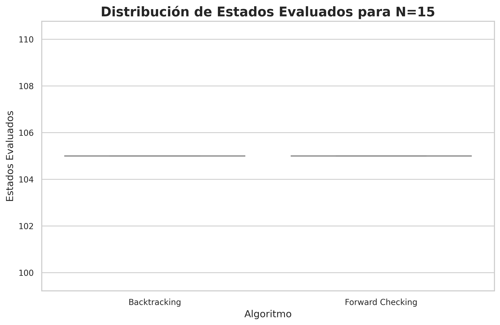
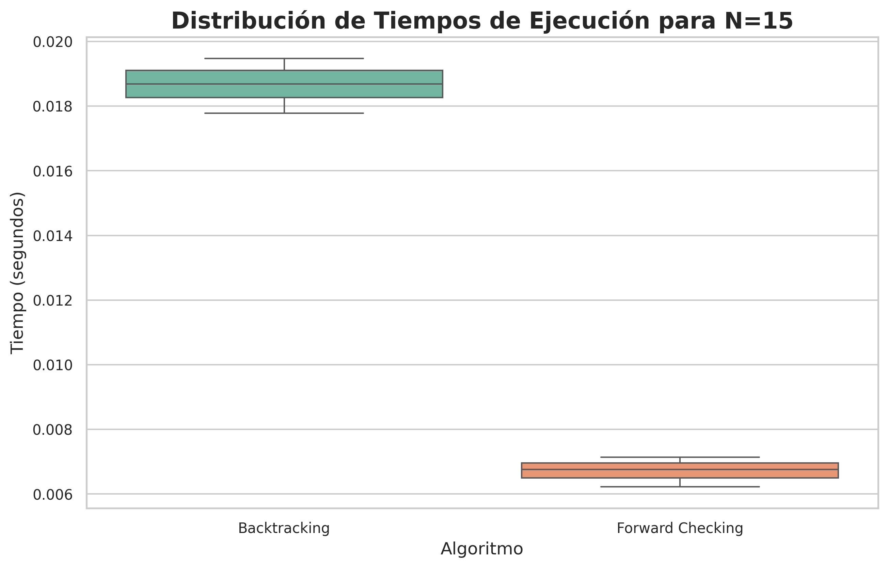

# Reporte Aida Laricchia - TP6 CSP

## 1. Formulación de un CSP para el Sudoku

- **Variables**: Cada celda en el tablero de Sudoku representa una variable. En un tablero de 9x9, hay 81 variables, y cada una puede tomar un valor entre 1 y 9. Denotamos cada variable como `Vij`, donde `i` y `j` indican la fila y la columna de la celda correspondiente.

- **Dominio**: El dominio de cada variable `Vij` es el conjunto `{1, 2, 3, 4, 5, 6, 7, 8, 9}`, que representa los valores posibles para cada celda. Si alguna celda tiene un valor predefinido, el dominio de esa variable se reduce a ese único valor.

- **Restricciones**:
  - **Restricción de filas**: Cada fila debe contener números del 1 al 9 sin repeticiones.
  - **Restricción de columnas**: Similar a las filas, cada columna debe contener los números del 1 al 9 sin repetir.
  - **Restricción de bloques 3x3**: El tablero se divide en 9 bloques de 3x3, y cada bloque debe tener los números del 1 al 9 sin repetirse.

## 2. Algoritmo AC-3 para la consistencia de arco en el problema de coloreo del mapa de Australia

Utilizamos el algoritmo AC-3 para verificar la consistencia de la asignación parcial `WA = Red` y `V = Blue` en el problema de coloreo del mapa de Australia. El objetivo es determinar si esta asignación cumple con las restricciones o si conduce a una inconsistencia.

### Paso 1: Dominio inicial
- `D(WA) = {R}`
- `D(V) = {B}`
- `D(NT), D(SA), D(Q), D(NSW) = {R, B, G}`

### Paso 2: Verificación de arcos

El algoritmo AC-3 revisa pares de regiones adyacentes y elimina valores inconsistentes de sus dominios:
  - **SA -> WA**: Se elimina `R` de `D(SA)`, dejando `D(SA) = {B, G}`.
  - **SA -> V**: Se elimina `B` de `D(SA)`, dejando `D(SA) = {G}`.
  - **NT -> SA**: Se elimina `G` de `D(NT)`, dejando `D(NT) = {R, B}`.
  - **NSW -> V**: Se elimina `B` de `D(NSW)`, dejando `D(NSW) = {R, G}`.
  - **NSW -> SA**: Se elimina `G` de `D(NSW)`, dejando `D(NSW) = {R}`.
  - **Q -> NSW**: Se elimina `R` de `D(Q)`, dejando `D(Q) = {B, G}`.
  - **Q -> SA**: Se elimina `G` de `D(Q)`, dejando `D(Q) = {B}`.
  - **NT -> Q**: Se elimina `B` de `D(NT)`, dejando `D(NT) = {R}`.
  - **NT -> WA**: Se elimina `R` de `D(NT)`, dejando `D(NT) = {}` (dominio vacío).

**Conclusión**: El dominio de `NT` queda vacío, lo cual indica que la asignación parcial es inconsistente y no es posible obtener una solución con estas restricciones.

## 3. Complejidad en el peor caso del algoritmo AC-3 en un CSP estructurado como un árbol

La complejidad en el peor caso de AC-3 es `O(E * D²)`, donde:
- `E` representa el número de arcos.
- `D` es el tamaño máximo de los dominios de las variables.

## 4. Optimización de la cola en AC-3 para mejorar la consistencia de arco

Para cada arco `(Xk, Xi)`, se puede llevar la cuenta de los valores restantes de `Xi` que son consistentes con cada valor de `Xk`. Esto permite:
- Registrar, para cada valor de `Xi`, las variables `Xk` para las cuales un arco hacia `Xi` se satisface con ese valor.
- Al eliminar un valor de `Xi`, reducir en 1 el conteo de valores permitidos para cada arco registrado `(Xk, Xi)`.

Esto optimiza la verificación de consistencia de arco y permite alcanzarla en un tiempo total de `O(N² * D²)`.

## 5. Correctitud del algoritmo CSP para árboles estructurados

### a) Demostración de que la 2-consistencia implica n-consistencia en CSPs con grafos en forma de árbol

En un CSP con un grafo de restricciones en forma de árbol, la 2-consistencia (consistencia de arco) asegura la `n-consistencia`, donde `n` es el número total de variables. Esto se debe a que en árboles:
  - Cada variable es consistente con las variables conectadas a ella.
  - Cualquier subconjunto de `k` variables (`k < n`) que sea consistente puede extenderse a una asignación consistente de la siguiente variable en el orden del árbol.

Dado que los árboles no contienen ciclos, no es necesario reconsiderar asignaciones previas, haciendo suficiente la 2-consistencia para garantizar la `n-consistencia`.

### b) Justificación de la suficiencia de la 2-consistencia

En un árbol, cada subconjunto de variables se puede extender de manera consistente hacia la siguiente variable, gracias a la estructura sin ciclos del grafo. Esto elimina la necesidad de verificar conjuntos más grandes de variables, permitiendo que la 2-consistencia sea suficiente para satisfacer todas las restricciones.

## 6.
En los resultados de los gráficos de distribución de estados evaluados y tiempos de ejecución para N=15:

**Distribución de Estados Evaluados**: Ambos algoritmos, Backtracking y Forward Checking, muestran una cantidad muy similar de estados evaluados, aproximadamente 106 en promedio, con muy poca variación. Esto sugiere que, para esta instancia particular (N=15), la estrategia de Forward Checking no reduce significativamente la cantidad de estados evaluados en comparación con el Backtracking puro.

**Distribución de Tiempos de Ejecución**: En cuanto al tiempo de ejecución, Forward Checking muestra un rendimiento significativamente mejor, con tiempos de ejecución promedio notablemente más bajos que Backtracking. Esto indica que, aunque la cantidad de estados evaluados es similar, la eficiencia de Forward Checking al reducir el espacio de búsqueda posible permite resolver el problema de manera más rápida.

Para el problema con N=15, el algoritmo de Forward Checking ofrece una ventaja en términos de tiempo de ejecución sin comprometer la cantidad de estados evaluados, lo cual lo hace más eficiente que el Backtracking tradicional.